## Actividad 1: El objetivo es crear una cuenta y repositorio en github y configurar nuestro equipo con ella.

### 1.1.Crear cuenta en github.

* Ingresa a la página de github ([https://github.com](https://github.com/)).
* Ingresa tus datos en el formulario de la web para registrarte, este se muestra en la siguiente imagen:

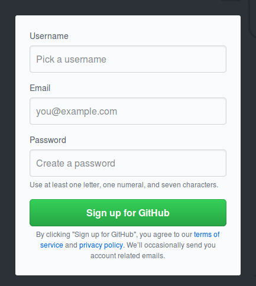

* Envía los datos del formulario que completaste.
* Te llegará un email a tu cuenta de correo para confirmar el registro, confírmalo!!
* Felicidades, ya estas registrado en github.

### 1.2.Crear un repositorio.

* Una vez registrado en github, puedes crear repositorios, para hacer esto lo primero que debes hacer es ingresar a github con tu cuenta. Esto lo puedes hacer en la siguiente dirección [https://github.com/login](https://github.com/login).

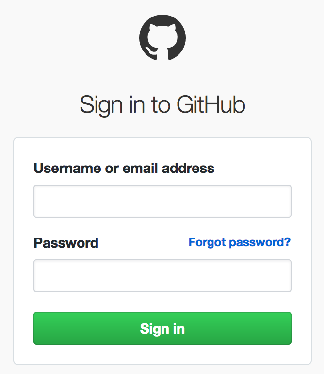

* Luego de ingresar a tu cuenta, inmediatamente github te da la opción de crear repositorios, tal como lo indica la imagen:

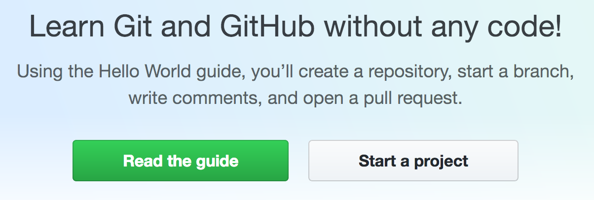

* A continuación da click en el botón iniciar proyecto, con lo cual, podrás completar los datos de tu repositorio. La imagen a continuación te muestra como sera:

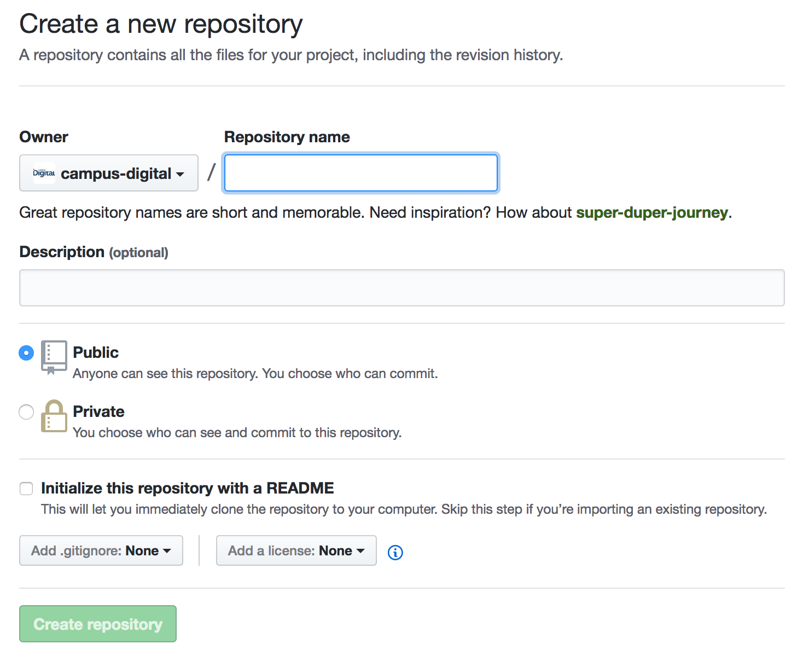

* Lo siguiente es ingresar los datos del nuevo repositorio, en nuestro caso le daremos el nombre de "***mitest***" y una descripción de que es para pruebas:

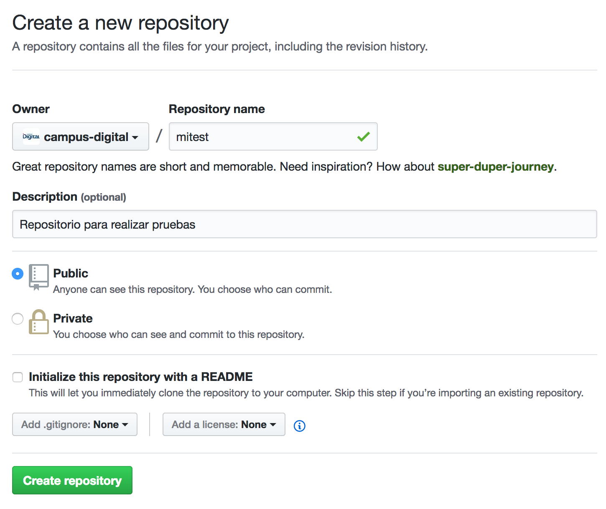

* Por último le damos click al botón crear y listo.

### 1.3.Clonar repositorio en equipo local.

* Una vez creado el repositorio, lo siguiente es clonarlo en tu equipo.
* Para hacer esto copiamos la dirección o URL de nuestro repositorio en github, esta dirección la obtienes inmediatamente después de crear el repositorio, tal como lo indica la imagen siguiente:

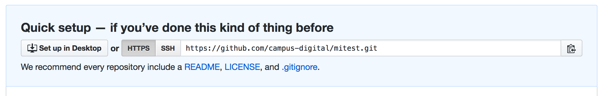

* A continuación abrimos la terminal o consola de comandos (ctrl+t).

* En nuestro directorio personal clonamos nuestro repositorio con el comando `git clone`, como lo indica la imagen siguiente:

        git clone https://github.com/campus-digital/mitest.git

> La dirección que sale en esta imagen hace referencia a la cuenta de campus digital, esta será diferente a la tuya, ya que la cuenta tuya es diferente. Por ende, no te preocupes si la URL que clonas no es la misma.

* Al terminar el proceso ya tenemos el repositorio clonado en nuestro equipo, este lo puedes verificar en la carpeta donde lo clonaste.

### 1.4.Configura la cuenta que creaste en tu equipo.

* Comenzaremos a configurar git en nuestro equipo con la cuenta que creaste en los pasos anteriores.
* Abrimos nuestra terminal o consola de comandos (ctrl+t). Debe ser similar a la siguiente imagen:

* Ingresamos los datos de nuestra cuenta, empezando por el nombre como se indica en el siguente ejemplo (recuerda que son tus datos):

        git config --global user.name "Juan Galleguillos"

* Ingresa tu mail con el comando:

        git config --global user.email "jgalleguillos@gmail.com"

* Podemos utilizar los comandos sin el último parámetro para visualizar los valores ingresados.

        git config --global user.name
        git config --global user.email

## Actividad 2: El objetivo es utilizar los comandos básicos.

### 2.1.Estado del repositorio

* Podemos ver en que **estado** se encuentra nuestro repositorio con el comando:

        git status

* Puedes verificar el estado de tu repositorio en cualquier momento con `git status`. Con lo cual, la terminal nos entrega la siguiente información:

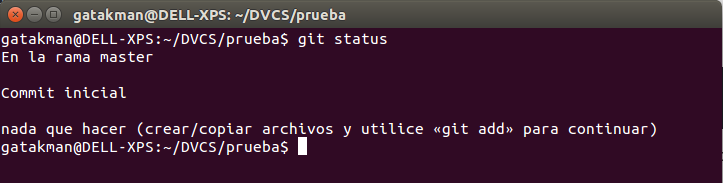

* Como muestra la imagen anterior, obtenemos:
  - La rama en la cual nos encontramos (master por defecto).
  - Si existen cambios en el repositorio, se visualizarán en diferentes colores, ahora como no tenemos cambios no se aprecian.
  - En este caso falta un commit inicial, el cual siempre es necesario al crear un repositorio.

### 2.2.Confirmación inicial

* Primero tenemos que crear un archivo con el nombre "***programa.py***" en el área de trabajo:

        vim programa.py

> En nuestro caso será un programa en python el cual puede ser escrito con cualquier editor de texto, sin embargo, si no conoces este lenguaje, puedes crear un archivo de texto.

* Creamos un programa básico al ingresarle el siguiente código (área de trabajo):

        #!/usr/bin/env python
        # -*- coding: utf-8 -*-

        print('Hola Mundo!!!')

* Guardamos el archivo editado, en caso de utilizar vim es con:

        :wq

* Si verificamos el estado del repositorio, nos daremos cuenta que git ya reconoció el nuevo archivo:

        git status

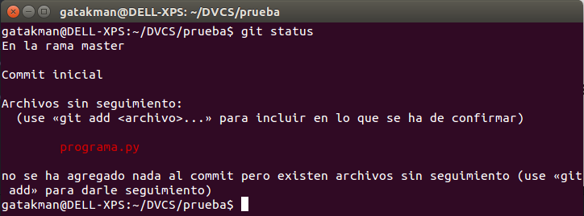

> Como indicamos enteriormente, git reconoce nuestros cambios y los visualiza con colores. En este caso nos indica que hay un archivo sin seguimiento y es necesario agregarlo al repositorio.

* Posteriormente agregamos nuestro programa al área de preparación con el siguiente comando:

        git add programa.py

> Cuando trabajes con más archivos probablemente agregar archivos uno por uno al área de preparación sea tedioso, sin embargo, se puede utilizar `git add -A` el cual agrega todos los archivos modificados.

* Podemos verificar nuestros cambios en el repositorio nuevamente con `git status`:

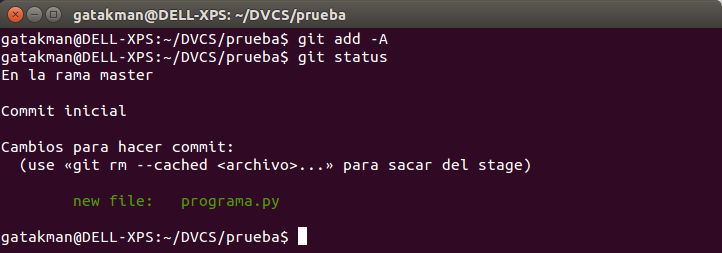

* Confirmamos nuestros cambios y se agrega un comentario con el siguiente comando (se confirman los cambios en el repositorio):

        git commit -m "Programa inicial"

* Verificamos el estado de nuestro repositorio nuevamente:

        git status

* Git nos informa que no hay cambios, ya que estos fueron confirmados:

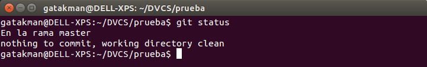

### 2.3.Confirmaciones realizadas (logs)

* Ahora como visualizamos los commits que hemos realizado ya que `git status` no lo hace.
* Para ver nuestros commit utilizamos el comando `git log`, el cual se ejecuta a continuación:

        git log

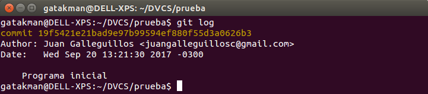

* La imagen anterior nos indica un listado con los commit realizados, en este caso solo el primero, además, nos entrega información importante como:
  - El código identificador del commit (sha-1) que esta en amarillo.
  - El autor del commit (responsable).
  - La fecha y hora de la creación.
  - El comentario del commit, el cual se recomienda que sea conciso.
* Ahora, realiza tu otros cambios al programa y repite el proceso (la idea es que realices varios commit, al menos 3, para ello escribe otras líneas o comentarios).
* Si verificamos los commits del repositorio nuevamente, deberíamos tener mas de uno, algo similar a lo siguiente:

* Como te diste cuenta, la visualización de los logs fue diferente, ya que podemos visualizar los log personalizados para mejorar la lectura con el comando:

        git log --pretty=oneline

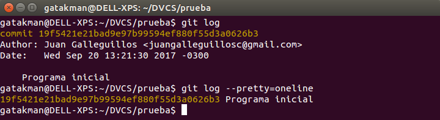

* Tú hazlo como mas te acomode, puedes visualizar los logs con mas opciones, esto lo puedes ver en la documentación [oficial](https://git-scm.com/docs/pretty-formats).

### 2.4.Subir cambios a un repositorio remoto

* Ya conoces los comandos básicos de git para trabajar localmente, sin embargo, para interactuar con un repositorio remoto es necesario conocer algunos más.
* Para subir tus cambios locales a un repositorio remoto utiliza el comando:

        git push origin master

> Recuerda que debe subir cambios a la misma rama en la que te encuentras y haz realizado modificaciones. En nuestro caso, solo tenemos la rama master.

* Como dato extra, a modo genérico el comando es así:

        git push origin <branch>

* Ahora cualquier persona puede bajar esos cambios que realizaste en esa rama.
* También puedes verificar los cambios en la web, en tu repositorio de github, revísalo online.

### 2.5.Bajar cambios de un repositorio remoto

* Para bajar cambios desde un repositorio utiliza el comando:

        git pull origin master

> Recuerda que debe bajar cambios a la misma rama para evitar conflictos.

* A modo genérico el comando es así:

        git pull origin <branch>
