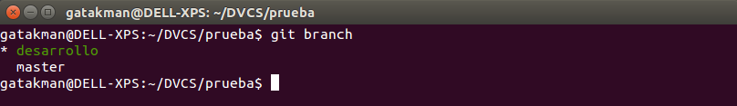
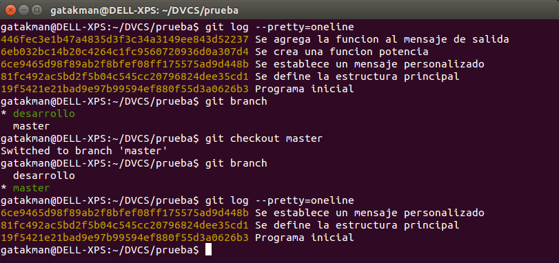

## Actividad 2: El objetivo es utilizar comandos avanzados de git.

### 2.1.Clona repositorio en equipo local.

* Clona el repositorio que creaste con anterioridad (Actividad 1).
* Para hacer esto copia la dirección o URL del repositorio desde github, esta dirección la obtienes cuando buscas un repositorio.

* Una vez encontrado el repositorio copia la URL del repositorio (boton verde).

* A continuación abre la terminal o consola de comandos (ctrl+t).

* Utiliza el comando `git clone`, como se indica a continuación:

        git clone <mi repositorio>

> La URL o dirección que sale en esta imagen es un ejemplo, esta será diferente segun el repositorio que quieras clonar.

* Verifica el estado de tu repositorio clonado utilizando el comando `git status`.

### 2.2.Muévete entre commits

* Una vez clonado tu repositorio, podrás visualizar los cambios que se han realizado a través del comando `git log --pretty=oneline`.

* Puedes moverte entre commit utilizando el siguiente comando:

        git checkout <idcommit>

* Donde "***idcommit***" es el código identificador del commit, el cual es el código sha-1 que nos muestra `git log`.

>Puedes utilizar una versión resumida del código identificador, utilizando los primeros 7 caracteres del código.

* Verifica el funcionamiento de este comando cambiándote a una versión anterior de tu proyecto.

>Podrás notar que al cambiar de versión, los archivos de tu repositorio local también cambian.

* Vuelve a la última versión de tu proyecto usando el comando `git checkout master`

### 2.3.Crea otras ramas

* Para ver las ramas que tienes y en la que te encuentras actualmente, utiliza el comando:

        git branch

* El comando anterior te muestra una lista con las ramas existentes y con un asterisco la rama actual (deberías tener solo master).

        * master

* Puedes crear otras ramas desde una rama inicial, la cual siempre es *master*, con el comando:

        git branch <nombre_nueva_rama>

* Crea la rama "***desarrollo***" de la siguiente manera:

        git branch desarrollo

* Si verificas tus ramas con `git branch`, deberías obtener lo siguiente:

### 2.4.Muévete entre ramas

>Las ramas te permiten mover entre diferentes espacios de trabajo. Cada rama es independiente de la otra hasta que se mezclen.

* Para moverte entre ramas utiliza el mismo comando que utilizas para moverte entre commits, con la diferencia que utilizas el nombre de la rama y no el id del commit, como se muestra a continuación:

        git checkout <nombre_rama>

* Muévete a la rama "desarrollo" que creaste:

        git checkout desarrollo

* Puedes verificar la rama actual con el siguiente comando:

#### Comprueba la independencia que existe en cada una de las ramas, a través de los siguientes pasos.

* Realiza modificaciones al "***programa.py***" en esta rama (desarrollo) y realiza los commits correspondientes. Obtendrás el siguiente resultado:

        git log --pretty=online
       

* Cámbiate a la rama `master` y verifica que no tiene los commits que creaste en la rama `desarrollo`:

>Como habrás notado, puedes tomar caminos diferentes según la rama en la que te encuentres, trabajando en paralelo sin que los cambios de una rama afecten a otra.

### 2.5.Fusiona las ramas.

>Con las ramas, no solo puedes crear caminos diferentes, sino que tambien puedes unirlos.
Para unir ramas o mover los commits desde una rama hacia otra tienes que fusionar las ramas.

* La fusión funciona ***desde otra rama hacia la actual***, es decir, si nos ubicamos en `master`, podemos fusionar desde `desarrollo` hacia `master`.

* Esto lo realizas de la siguiente manera (recuerda estar en master):

        git checkout master
        git branch
        git merge desarrollo

>La fusión te indica que líneas se modificaron.

* Verifica el estado de los commits en ambas ramas y te darás cuenta que ahora ambas tienen los mismos commits, ya que fusionaste.

### 2.6.Elimina las ramas.

* Elimina la rama `desarrollo` creada en los pasos anteriores, utilizando el siguiente comando.

        git branch -D desarrollo
     
>Recuerda que también es posible publicar tus ramas en el servidor remoto para que pueda ser visualizada por los demás miembros del equipo. Esto se utiliza en ocasiones donde existen diferentes ambientes de trabajo, como un entorno de desarrollo, pruebas y producción.